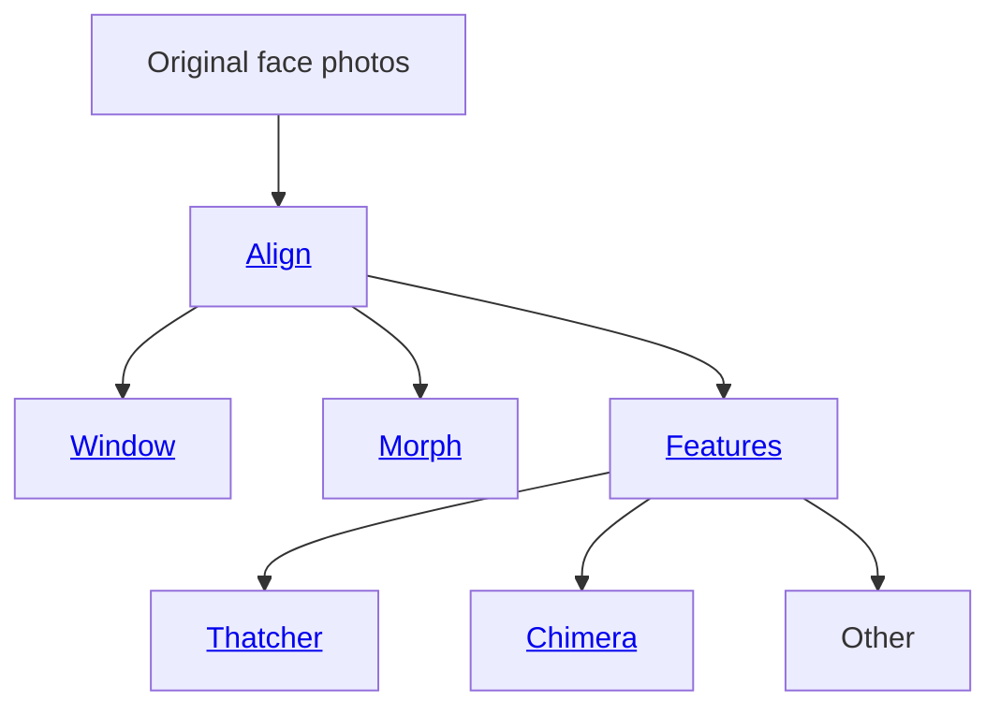
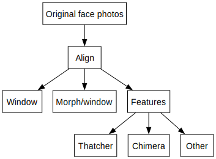
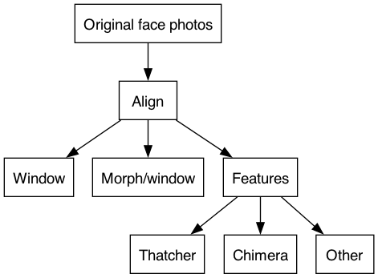
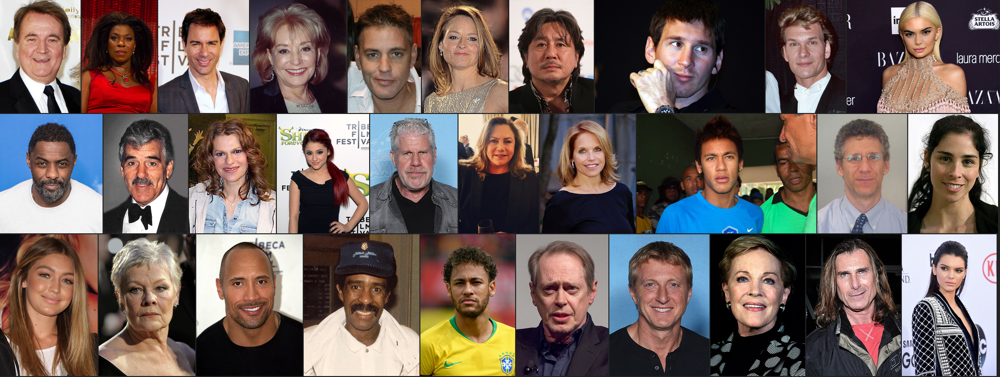
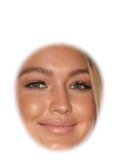
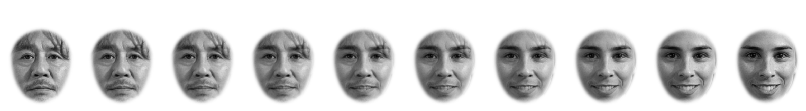
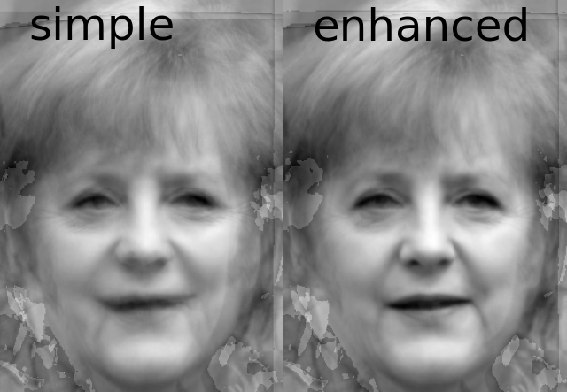

<!-- Face Alignment and Decomposition (FAD)
================ -->
# Face Alignment and Decomposition (FAD)

Carl M. Gaspar & Oliver G.B. Garrod

A Python package that generates face stimuli for a wide range of psychology and neuroscience experiments.

These are the two main functions supported by FAD:

* [Face alignment](#alignment-id) that is validated on databases popular among experimental psychologists
* **Isolation and rearrangement of facial features** using a novel method based on human physiology

Along with other functions (**morphing** and **windowing**), FAD can produce some of the most popular types of stimuli used in face perception studies (e.g., Chimeric faces).

FAD can also be used to produce stimuli yet to be studied -- using novel feature arrangements and combinations of morphing and feature arrangement.




<!-- <svg width="100" height="100">
  <circle cx="50" cy="50" r="40" stroke="green" stroke-width="4" fill="yellow" />
  Sorry, your browser does not support inline SVG.
</svg> -->

<!--  -->

<!-- {{ readFile "overview.svg" | safeHTML }} -->

<!--  -->

<!-- 

 -->

# Alignment {#alignment-id}



But you want to line up all of the faces like this:


<!-- #### Specifically, the locations of facial features should overlap across images, as you can confirm here: -->

<!--  -->
<!-- <p align="center" width="100%">
    
</p> -->
Perhaps you would also like to window the faces to show only inner facial features like this:


All of the above can be done using AFA like this:

```python
import alignfaces as afa

faces_path = "/Users/Me/faces_for_my_study/"
afa.get_landmarks(faces_path)
aligned_path = afa.align_procrustes(faces_path)
afa.get_landmarks(aligned_path)
the_aperture, aperture_path = afa.place_aperture(aligned_path)
```

To better understand how to write a script for your specific purposes, we direct you to [demo 1](demos/align/1_basic/README.md). [Demo 1](demos/align/1_basic/README.md) also describes how AFA alignment works.

All of these functions depend on reliable detection of facial landmarks, which is provided by the [DLIB](http://dlib.net) library. Alignment is based on generalized Procrustes analysis (GPA), which extensively unit tested.

# Additional functions (warping)  {#warping-id}

Automatic landmark detection means that it is also easy to separate **shape** and **texture** in order to produce various kinds of **warped** images.

AFA provides functions for two types of face-warping manipulations common in face perception research.

## Morphing between faces
<!-- Here we gradually morph between [Choi Min-sik](https://en.wikipedia.org/wiki/Choi_Min-sik) (on the far left) and [Sarah Silverman](https://en.wikipedia.org/wiki/Sarah_Silverman) (on the far right) in equal 9 steps:
 -->
To learn how to do this please see [demo 2](demos/align/2_morph/README.md).

## Enhanced average of facial identity
<!-- First we used AFA to align various photos of [Tony Blair](https://en.wikipedia.org/wiki/Tony_Blair) taken at different times and under different conditions. A simple average of these aligned faces is shown on the left.

Prior to averaging, we can also use AFA to warp each image of Tony Blair to match the average of landmark positions across each instance of Tony Blair. This enhanced average is shown on the far right.

<p align="center" width="100%">
    
</p> -->

<!-- This **enhanced facial average** was first demonstrated by

> Burton, A. M., Jenkins, R., Hancock, P. J. B., & White, D. (2005). Robust representations for face recognition: The power of averages. Cogn Psychol, 51(3), 256–284. https://doi.org/10.1016/j.cogpsych.2005.06.003

We used the same photos of Tony Blair as they used (in their Figure 3).

Manual landmark selection was required in Burton et al. (2005), whereas AFA automated the entire process in our demo. -->

To learn how to do this please see [demo 3](demos/align/3_average/README.md).

# Setup 🚀  {#setup-id}

It is highly recommended that you have **conda** installed, preferably **miniconda** rather than full fat **anaconda**.

If you do have **conda**, then do the following to install:

```bash
conda create --name fad conda-forge::dlib "python>=3.9" scikit-image

conda activate fad

conda install -c conda-forge matplotlib

conda install tqdm

pip install "fad @ git+https://git@github.com/SourCherries/fad.git"
```

This will create a new virtual environment called `fad`. You can use another name for that. You'll need to activate this environment using `conda activate fad` whenever you want to use FAD. To deactivate, simply type `conda deactivate`.

Windows users may encounter a problem with plotting. That is a [general issue](https://stackoverflow.com/questions/69786885/after-conda-update-python-kernel-crashes-when-matplotlib-is-used) with **Matplotlib** on Windows. To fix, simply type the following while your `fad` is activated:

```bash
conda install freetype=2.10.4
```

# How well does this work? 🚀  {#validate-id}

In addition to unit-testing critical computations, I evaluated both landmark estimation (DLIB) and the outcome of the entire alignment procedure using various face databases (spanning ethnicity and facial expression). The results are described [here](results/README.md).

# Citation 🚧  {#cite-id}

If you use this package for your research, please cite the following preprint:
>Gaspar, C. M., & Garrod, O. G. B. (2021, November 8). A Python toolbox for Automatic Face Alignment (AFA). Retrieved from psyarxiv.com/erc8a

DOI:
>10.31234/osf.io/erc8a

# License 🚀  {#license-id}

This module is under an Apache-2.0 license.
