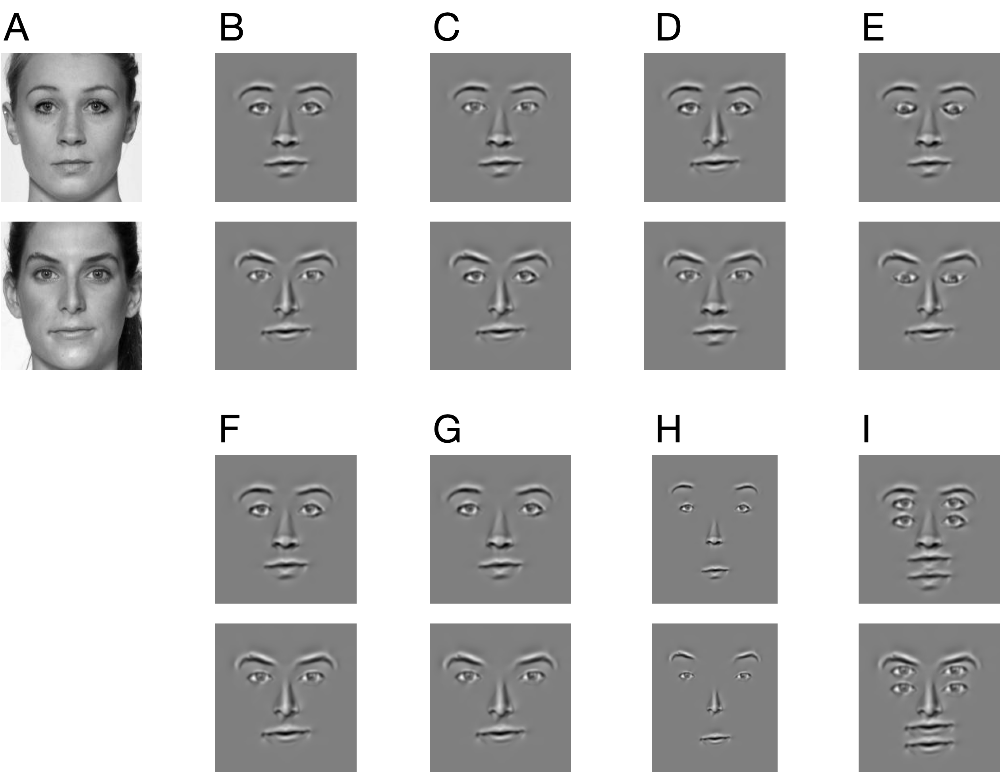

<!-- Face Alignment and Decomposition (FAD)
================ -->
# Face Alignment and Decomposition (FAD)

Carl M. Gaspar & Oliver G.B. Garrod

A Python package that generates face stimuli for a wide range of psychology and neuroscience experiments.

These are the two main functions supported by FAD:

* [**Face alignment**](#alignment-and-windowing) that is [validated](results/README.md) on databases popular among experimental psychologists
* [**Isolation and rearrangement of facial features**](#feature-isolation-and-rearrangement) using a [novel method](demos/features/README.md) based on human physiology

Along with other functions ([**morphing**](#morphing) and [**windowing**](#alignment-and-windowing)), FAD can produce some of the most popular types of stimuli used in face perception studies:

1. Whole-part effect
2. Composite faces
3. Thatcher faces
4. Second-order feature manipulations
5. Uncrowded faces
6. Double-face illusion
7. Morphing between faces
8. Enhanced average of facial identity
9. Any type of stimulus that requires feature rearrangement

FAD can also be used to produce stimuli yet to be studied -- using novel feature arrangements and combinations of morphing and feature arrangement.

# Alignment and windowing


We give **FAD** a collection of face images (**A**) and it spatially aligns all of the faces (**B**) and can also set them in an aperture (**C**).

There are two ways to do this.

The *object-oriented* approach may be preferable as it provides an easy-to-use interface for rearranging facial features.

The *functional* approach however affords greater flexibility.

## Object-oriented approach

Simply create an instance of a face `Ensemble`:

```python
import fad as fd

faces_path = "/Users/Me/faces/"
bookends = ("","jpg")

face_library = fd.Ensemble(dir_source=faces_path,
                           file_bookends=bookends, 
                           INTER_PUPILLARY_DISTANCE=64, 
                           make_windowed_faces=True)
```

This will automatically generate aligned faces in a folder `/Users/Me/faces-aligned/`, and both aligned and windowed faces in a folder `/Users/Me/faces-aligned-windowed/`.

<details>
  <summary><i>Understanding the object-oriented approach</i></summary>

The variable `bookends` tells **FAD** what image files to include in your processing. In this case, all files that end in `jpg`. If you want to include only files that begin with `female` and end in `jpg` then you would write `bookends=("female","jpg")`.

To generate aligned faces, you must specify `INTER_PUPILLARY_DISTANCE` in pixels. This will ensure all aligned faces have the same inter-pupillary distance and make feature processing efficient. For more flexibility in the dimensions of aligned faces, you must take the *functional approach* described in the next section.

To generate faces that are both aligned and windowed, you must set `make_windowed_faces` to `True`.

If you also want to decompose all of your faces into facial features you can set `make_all_features` to `True`. We cover facial features in another section.

If you only need aligned and windowed faces, then the above code snipped is all you need.

The variable `face_library` is an instance of a face `Ensemble` that contains all of the information required do further processing -- morphing, feature rearrangement, or some combination of the two.

`face_library` has a number of attributes for managing your workflow like `face_library.INTERPUPILARY_DISTANCE`, `face_library.landmarks`, and `face_library.aperture`.

`face_library` also has methods for performing further processing, which are covered in another section. Here are some simple functions you can call once you have created the Ensemble `face_library`:

```python
face_library.list_faces()  # lists faces in Ensemble
face_library.add_to_roster("dick") # adds dick.jpg to your Roster
face_library.add_to_roster("jane") # adds jane.jpg to your Roster
face_library.clip_roster_margins(margins=(1/6, 1/4))  # crop images in your Roster
face_library.display_roster()  # display figure of each face in your Roster one-by-one
```

To understand how FAD alignment works, please see [demo 1](demos/align/1_basic/README.md).

</details>

## Functional approach

Alternatively, we can make calls to individual **FAD** functions:

```python
from fad import align as af

faces_path = "/Users/Me/faces/"
file_prefix = ""
file_postfix = "jpg"
af.get_landmarks(faces_path)

adjust_size, size_value = "set_eye_distance", 64
aligned_path = af.align_procrustes(faces_path,
                                   file_prefix,
                                   file_postfix,
                                   adjust_size=adjust_size, 
                                   size_value=size_value)
af.get_landmarks(aligned_path, file_prefix, file_postfix)
the_aperture, aperture_path = af.place_aperture(aligned_path,
                                                file_prefix, 
                                                file_postfix)
```

This will automatically generate aligned faces in a folder `/Users/Me/faces-aligned/`, and both aligned and windowed faces in a folder `/Users/Me/faces-aligned-windowed/`.

To better understand how to write a script for your specific purposes, and to understand how FAD alignment works, please see [demo 1](demos/align/1_basic/README.md).

# Feature isolation and rearrangement

Faces with rearraranged facial features are a popular stimulus in psychology. **FAD** allows you to perform these rarrangements programatically.

**FAD** uses wavelets to locally reconstruct 6 different facial features as 6 separate images: left eyebrow, right eyebrow, left eye, right eye, nose, and mouth. Superimposing these images in different ways can result in different types of stimuli.

The figure below shows 6 types of stimuli that can be generated by **FAD** with very little code (**C**,**D**,**E**,**G**,**H**,**I**):



Each lettered section shows the same pair of faces. The original (aligned) faces are in section **A**. Faces in section **B** facial features reconstructed with wavelets but not rearranged; faces in section **F** are the same as **B** for easy comparision with face pairs in that row.

1. Faces to study the **whole-part effect** are shown in **C**. Eyes are swapped between the 2 face identities. Other features can be swapped.

2. **Chimeric** or **composite** faces are shown in **D**. Bottom halves (nose and mouth) are swapped between the 2 face identities.

3. **Thatcher** faces are shown in **E**. Eyes are rotated upside-down.

4. The spacing between eyes is altered in **G**. In the parlance of face research, we manipulated a **second order relation**.

5. Spacing among all features can be altered relative to a common center, as shown in **H**. This is sometimes done in studies of **peripheral vision**, to induce/alleviate **crowding**.

6. Stimuli in **I** can be used to induce the so-called **double-face illusion**, a phenomenon associated with **perceptual stability**.

The first 4 types of stimuli (**C**, **D**, **E**, **G**) are among the most popular types of face stimuli used in research, accounting for hundreds of publications.

All 6 types of stimuli shown above were created with **FAD** using an easy-to-use programming interface. The figure above can be reproduced by running a [single script](demos/features/run_demos.py).

## Perceptual quality of reconstructed features

Here is a simple demo that shows 4 of the celebrities from the *Friends* TV show, along with versions that are locally reconstructed from wavelets:


As one can see, the reconstructed versions strongly resemble their originals.

More importantly, the method we devised to reconstruct features has been heavily informed by empirically supported models of human visual physiology. Read more about [those details here](demos/features/README.md).

## FAD features blend into the background

One benefit of FAD features is that they naturally bleed into a common background. That background is the same (default) gray level in all of our examples, but that can be changed programatically.

Here is a movie that illustrates how features look as they get closer together and begin to overlap:


# Morphing

Automatic landmark detection means that it is also easy to separate **shape** and **texture** in order to produce various kinds of **warped** images.

FAD provides functions for two types of face-warping manipulations common in face perception research.

## Morphing between faces


To how to do morphing with **FAD** using the *functional approach* please see [demo 2](demos/align/2_morph/README.md). This also provides a description of the underlying method, which has been unit-tested.

To how to do morphing with **FAD** using the *object-oriented approach* please see [this script](demos/features/demo_morphs.py).

## Enhanced average of facial identity


To learn how to make an *enhanced average* using the *functional approach* please see [demo 3](demos/align/3_average/README.md).

To learn how to make an *enhanced average* using the *object-oriented approach* please see [this script](demos/features/demo_averages.py). This also provides a description of the underlying method, which has been unit-tested.

# Setup

It is highly recommended that you have **conda** installed, preferably **miniconda** rather than full fat **anaconda**.

If you do have **conda**, then do the following to install:

```bash
conda create --name fad conda-forge::dlib "python>=3.9" scikit-image

conda activate fad

conda install -c conda-forge matplotlib

conda install tqdm

pip install "fad @ git+https://git@github.com/SourCherries/fad.git"
```

This will create a new virtual environment called `fad`. You can use another name for that. You'll need to activate this environment using `conda activate fad` whenever you want to use FAD. To deactivate, simply type `conda deactivate`.

Windows users may encounter a problem with plotting. That is a [general issue](https://stackoverflow.com/questions/69786885/after-conda-update-python-kernel-crashes-when-matplotlib-is-used) with **Matplotlib** on Windows. To fix, simply type the following while your `fad` is activated:

```bash
conda install freetype=2.10.4
```

## Local install

For copies of all the demos for developers who want to contribute, you may want to clone the entire package onto your local machine.

Again you'll need **conda**:

```bash
conda create --name fad conda-forge::dlib "python>=3.9" scikit-image

conda activate fad

conda install -c conda-forge matplotlib

conda install tqdm

pip install -U pytest
```

Now navigate to a folder where you want **FAD** installed then do the following in that folder:

```bash
git clone git@github.com:SourCherries/fad.git

cd fad

pip install .
```

To run unit tests, make sure you are still in the `fad` folder you just installed:

```bash
pytest -v src/fad/align/tests/
```

# How well does this work?

Alignment and feature processing in **FAD** depend on reliable detection of facial landmarks, which is provided by the [DLIB](http://dlib.net) library.

Alignment is based on generalized Procrustes analysis (GPA), which was extensively unit tested.

In addition to unit-testing critical computations, we evaluated both landmark estimation (DLIB) and the outcome of the entire alignment procedure using various face databases (spanning ethnicity and facial expression). The results are described [here](results/README.md).

# Citation 🚧 NEED TO UPDATE AFTER NEW MANUSCRIPT

If you use this package for your research, please cite the following preprint:
>Gaspar, C. M., & Garrod, O. G. B. (2021, November 8). A Python toolbox for Automatic Face Alignment (AFA). Retrieved from psyarxiv.com/erc8a

DOI:
>10.31234/osf.io/erc8a

# License

This module is under an Apache-2.0 license.
