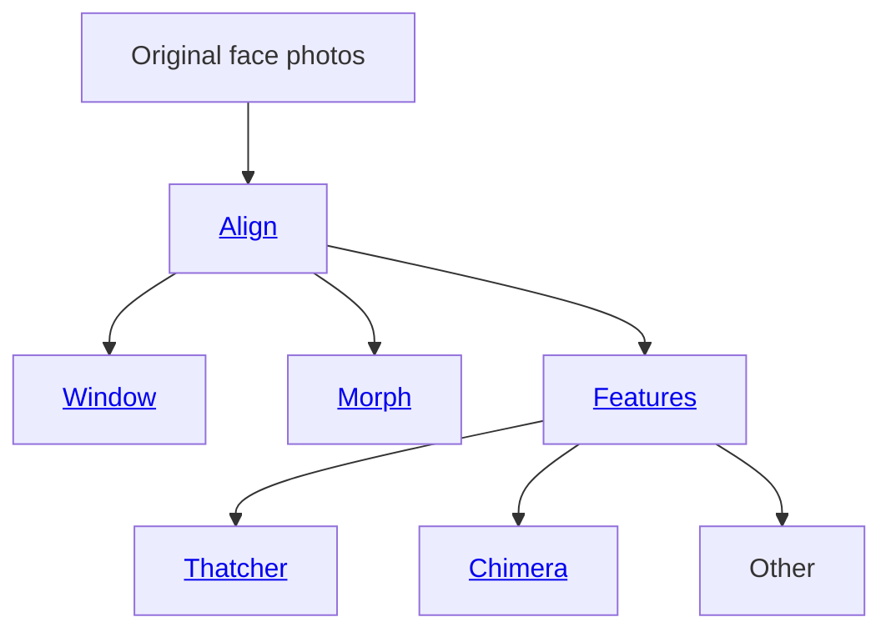

```mermaid
    graph TD;
        original[Original face photos]

        align[<a href='https://github.com/SourCherries/fad/blob/main/demos/align/1_basic/README.md'>Align</a>]

        window[<a href='https://github.com/SourCherries/fad/blob/main/demos/align/1_basic/README.md#windowing'>Window</a>]

        morph[<a href='https://github.com/SourCherries/fad/blob/main/demos/align/2_morph/README.md'>Morph</a>]

        features[<a href='https://github.com/SourCherries/fad/tree/main/demos/features'>Features</a>]

        thatcher[<a href='https://github.com/SourCherries/fad/tree/main/demos/features/figs/thatcher.png'>Thatcher</a>]

        chimera[<a href='https://github.com/SourCherries/fad/tree/main/demos/features/figs/chimera.png'>Chimera</a>]        

        other[Other]

        original --> align
        align --> window
        align --> morph
        align --> features
        features --> thatcher
        features --> chimera
        features --> other
```